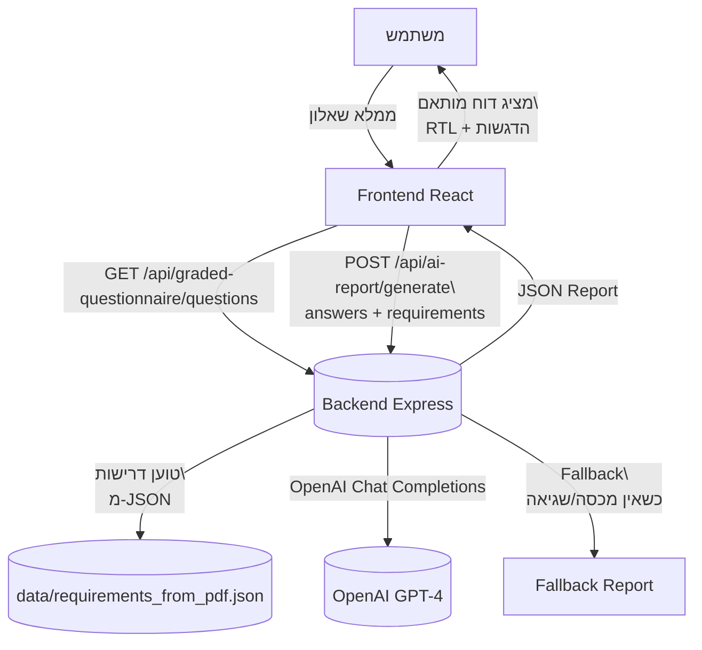

# ארכיטקטורת המערכת

מערכת הערכת רישוי עסקים למסעדות בישראל. הזרימה: שאלון → התאמת דרישות → יצירת דוח (LLM או Fallback) → תצוגה.

## תרשים זרימה

## רכיבים
- Frontend (React)
  - `frontend/src/components/GradedQuestionnaire.js` – שאלון ומעבר בין שאלות
  - `frontend/src/components/AssessmentReport.js` – תצוגת דוח מודגש (RTL, המרת Markdown בסיסית)
- Backend (Node.js + Express)
  - `backend/routes/gradedQuestionnaire.js` – שליפת שאלות ושירותי עזר
  - `backend/routes/aiReport.js` – יצירת דוח AI
  - `backend/services/gradedQuestionnaire.js` – עיבוד תשובות והתאמת דרישות
  - `backend/services/regulatoryDocumentLoader.js` – טעינת דרישות מ-JSON (ברירת מחדל, PDF כגיבוי)
  - `backend/services/aiReportService.js` – בניית פרומפט, קריאה ל-OpenAI, Fallback במקרה כשל/מכסה
- Data
  - `data/requirements_from_pdf.json` – מאגר דרישות מובנה
- Scripts
  - `scripts/convert_doc_to_json.js` – המרת PDF/Word ל-JSON (דמו)

## נקודות קצה
- `GET /api/graded-questionnaire/questions` – שליפת שאלון
- `POST /api/ai-report/generate` – יצירת דוח AI/גיבוי
- `GET /api/health` – בדיקת תקינות

## מדיניות Fallback
כאשר מתקבלת שגיאת מכסה/הקשר (429/insufficient_quota או context length) – נוצרת תשובה אוטומטית (Fallback) עם `generatedBy: "Fallback System"`, וה-Frontend מציג הודעה ברורה למשתמש.

## ניהול טוקנים
- קיצור ציטוטים ל~160 תווים
- הגבלת קטגוריות (עד 6) ו-2 דרישות ייחודיות לקטגוריה
- `max_tokens` מותאם ל-2000 כדי להפחית חיתוך
